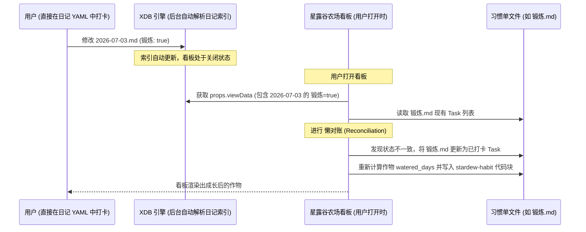

# 星露谷风格单文件打卡与作物生命周期最终方案设计

本方案为单文件打卡及作物生命周期的**最终完备版设计**。针对**“组件在未打开时无法进行实时后台监听，导致日记打卡数据无法同步”**的问题，本设计舍弃了高开销的后台常驻监听器，转而采用**“基于 XDB 缓存视图数据的懒同步/轻量级对账（Lazy Sync / Reconciliation）”**方案，实现完美的数据闭环。

---

## 1. 核心设计：基于 XDB 视图数据的“懒同步”机制

### 1.1 问题剖析
在 XDB 插件体系下，[view.tsx](file:///e:/WorkSpace/Others/XDB/Log/src/view.tsx) 的视图组件仅在用户打开“星露谷农场”看板时才会被挂载（Mount）并执行。如果用户在未打开看板的情况下，直接在日记文件中通过 YAML 属性打卡，常驻的全局事件监听不仅容易造成内存泄漏，还会因为组件生命周期未就绪而失效。

### 1.2 懒同步（懒对账）解决方案
不使用后台实时监听，而是在 **看板组件打开或更新（`onUpdate` 触发）时，进行一次快速的“懒对账”**。
由于 XDB 在后台已经对整个 Vault 的文件（包括日记）进行了元数据索引，并将其封装在了 `props.viewData` 中，我们可以直接利用这个高速的内存缓存，而不需要重复读取磁盘上的所有日记文件。



---

## 2. 懒同步核心对账算法

在 [view.tsx](file:///e:/WorkSpace/Others/XDB/Log/src/view.tsx) 的 `onUpdate(props)` 执行时，执行以下快速对账流程：

### 2.1 数据源对账逻辑
1. **获取日记视图数据**：
   从 `props.viewData` 中扁平化获取所有已记录的日记行数据：
   `const dailyNotes = viewData.groups.flatMap(g => g.rows ?? []);`
   每行 `$item` 包含日记的文件名日期和打卡属性（例如 `$item['锻炼']` 为 `true` 或 `false`）。
2. **读取单文件数据**：
   异步读取打卡文件夹下的 `锻炼.md`，使用正则解析出其 `stardew-habit` 代码块中的元数据和 Task 列表（`tasks`）。
3. **双向比对并纠偏**：
   * **情况 A：日记有记录，单文件无记录（日记直接打卡）**
     若某天日记（如 `2026-07-03`）中 `锻炼: true`，但 `锻炼.md` 中没有该日期的打卡记录，或者记录为未打卡 `- [ ]`：
     ➔ 自动在 `锻炼.md` 中将该日期修改/新增为 `- [x] [[2026-07-03]] 11:08:00 (自动同步)`，并使当前作物的 `watered_days + 1`。
   * **情况 B：看板直接打卡，需同步日记**
     当用户在看板 UI 上点击打卡时，除了写入 `锻炼.md` 之外，**立刻调用 XDB 提供的 API** 更新日记对应的单元格：
     `await props.api.updateCell(rowId, '锻炼', true);`
     这会由 XDB 自动写入日记的 YAML 中，无需我们手动操作日记文件。
   * **情况 C：日记被取消打卡**
     若某天日记中 `锻炼` 被改为了 `false`，但 `锻炼.md` 中为已完成 `- [x]`：
     ➔ 自动在 `锻炼.md` 中将其修正为 `- [ ] [[Date]]`，并减少相应作物的 `watered_days`。

---

## 3. 优化后的数据与文本结构

### 3.1 带有备注与时间戳的 Task 格式
在对账和写入时，严格保留用户的个人备注：
```markdown
- [状态] [[日期链接]] 时间戳 备注信息
```

### 3.2 习惯单文件示例 ([锻炼.md](file:///e:/WorkSpace/Others/XDB/Log/docs/打卡设计/锻炼.md))
```markdown
# 打卡

- [x] [[2026-07-03]] 11:08:42 自动同步
- [x] [[2026-07-02]] 08:30:22 跑了3公里
- [ ] [[2026-07-01]] 昨天没打卡

# 种植记录

```stardew-habit
current_crop:
  id: "490"                 # 南瓜
  start_date: 2026-07-01    # 种植日期
  stage: 2                  # 生长阶段
  watered_days: 2           # 已浇水/打卡天数
  last_watered_date: 2026-07-03

crop_history:
  - id: "472"
    start_date: 2026-06-15
    end_date: 2026-06-28
    status: "harvested"
    watered_days: 13
```


```

---

## 4. 健壮性保障与关键算法实现

### 4.1 非破坏性正则提取与更新 (TypeScript)
为了在同步时完全保留用户写下的备注信息，必须使用捕获正则：
* 解析正则：`/^\s*-\s*\[([ xX])\]\s*\[\[([^\]]+)\]\](?:\s+(\d{2}:\d{2}:\d{2}))?(.*)$/`

在 [crop-loader.ts](file:///e:/WorkSpace/Others/XDB/Log/src/crop-loader.ts) 或同步模块中进行如下实现：

```typescript
export function reconcileAndSave(
  app: any,
  file: any, // 锻炼.md
  dailyNotesData: Array<{ dateStr: string; isDone: boolean }>,
  dateFormat: string
) {
  return app.vault.process(file, (content: string) => {
    const { metadata, tasks } = parseHabitFile(content, dateFormat);
    let changed = false;

    for (const note of dailyNotesData) {
      const taskIndex = tasks.findIndex(t => t.dateStr === note.dateStr);
      
      if (note.isDone) {
        if (taskIndex === -1) {
          // 1. 日记已打卡但单文件无记录 -> 新增已打卡项
          tasks.unshift({
            isDone: true,
            dateStr: note.dateStr,
            originalLink: window.moment(note.dateStr).format(dateFormat),
            timeStr: window.moment().format('HH:mm:ss'),
            note: '自动同步'
          });
          changed = true;
        } else if (!tasks[taskIndex].isDone) {
          // 2. 日记已打卡但单文件为未完成 -> 更新状态
          tasks[taskIndex].isDone = true;
          tasks[taskIndex].timeStr = window.moment().format('HH:mm:ss');
          changed = true;
        }
      } else {
        if (taskIndex >= 0 && tasks[taskIndex].isDone) {
          // 3. 日记取消打卡但单文件为已完成 -> 更新为未完成
          tasks[taskIndex].isDone = false;
          delete tasks[taskIndex].timeStr;
          changed = true;
        }
      }
    }

    if (!changed) return content; // 无状态变更则不重新写入文件，避免多余的 I/O

    // 4. 重新计算作物生长天数
    if (metadata.current_crop) {
      const cropStart = metadata.current_crop.start_date;
      metadata.current_crop.watered_days = tasks.filter(
        t => t.isDone && t.dateStr >= cropStart
      ).length;
    }

    // 5. 序列化并回写
    const newYaml = stringifyYaml(metadata);
    const titleMatch = content.match(/^([\s\S]*?)#\s+\S+/);
    const titleHeader = titleMatch ? titleMatch[1].trim() : '';

    const newBlock = `# ${file.basename}\n\n\`\`\`stardew-habit\n${newYaml}\`\`\``;
    const taskLines = tasks.map(t => {
      const timePart = t.timeStr ? ` ${t.timeStr}` : '';
      const notePart = t.note ? ` ${t.note}` : '';
      return `- [${t.isDone ? 'x' : ' '}] [[${t.originalLink}]]${timePart}${notePart}`;
    });

    return `${titleHeader}\n${newBlock}\n\n${taskLines.join('\n')}\n`;
  });
}
```

### 4.2 趣味惩罚：作物干旱枯萎 (Withering)
* **计算时机**：对账完成后，在重绘看板前进行检测。
* **规则**：若 $today - last\_watered\_date \ge 7$ 天且作物正在生长期，自动在代码块中将 `current_crop.stage` 置为枯萎状态并存档。
